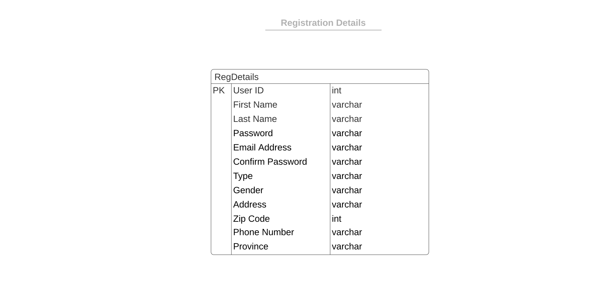
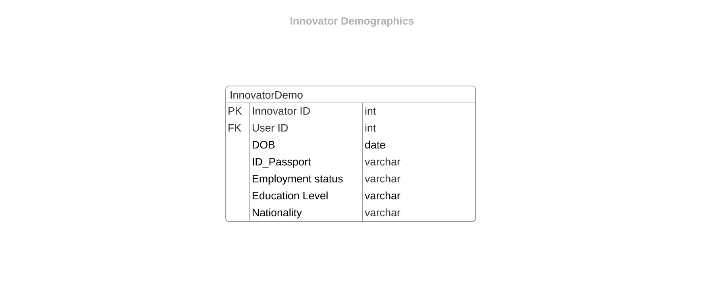
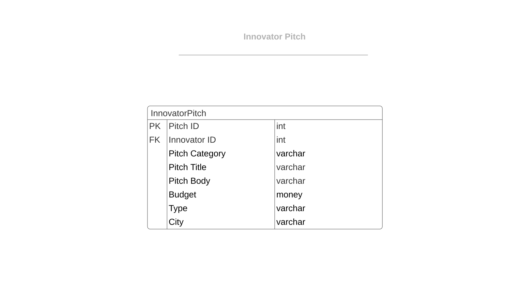
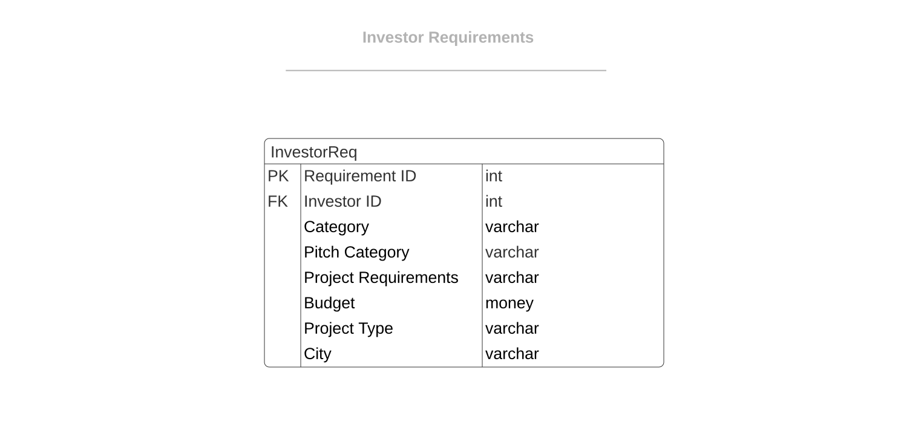
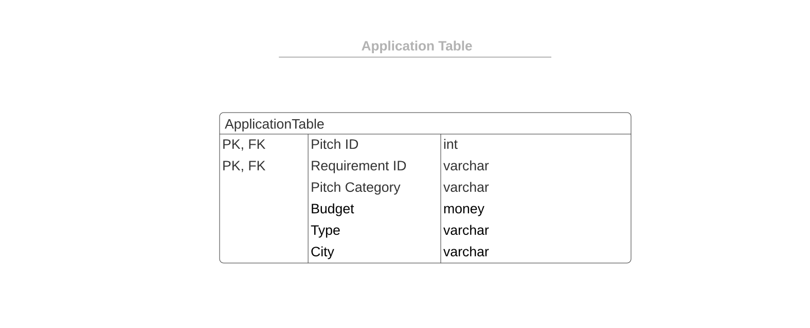
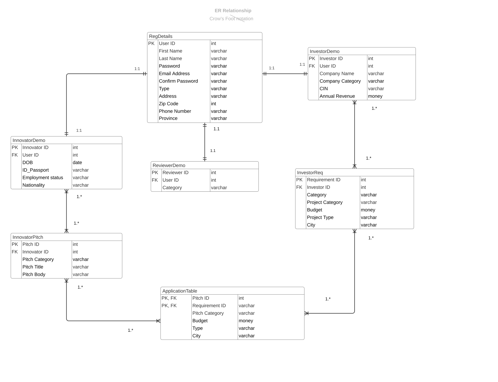

# THE DATABASE DESIGN PROCESS TEAM 23 
	
## <u>	DATABASE PURPOSE </u>

The major purpose of the database is to collect, manage and disseminate information efficiently. It should be able to store user data and allow reviewers to present analytic results based on the data in the database. The database is going to be directly accessed and managed by the reviewers only and will contain various information about the website users. The database will also give innovators and investors a record as to which stage they are at or which actions they have taken in the past. 
	
### <u>	Database Development and Management Tools </u>
	
There is various database management software we can use like Oracle SQL Developer (Oracle) or MySQL Workbench (MySQL) but for our database we plan on using the Standard Microsoft Visual Basics 2019 console SQL Server Management Studio (SQL Server).
	
## <u>	REQUIRED ATTRIBUTES </u>
	
<u>	1. INNOVATOR </u>
	 
		• First Name 
		• Last Name
		• Email address 
		• Password 
		• Confirm Password
		• Phone Number
		• Physical Address 
		• DOB
		• ID/Passport Number
		• Level of Education
		• Employment Status
		• Zip Code
		• Province
		• Nationality
		
	 
<u>	2. INVESTOR </u>
	 
		• Company Name
		• Category/Trade  
		• CIN (Corporate Identity Number)/Enterprise Number 
		• Registered Email
		• Registered Address 
		• Zip Code
		• Phone number
		• Province 
		• Annual Revenue
	 
<u>	3. REVIEWER </u>
	 
		• Reviewer ID
		• Name
		• Surname
		• Email Address 
		• Password
		• Confirm Password
		• Category

### <u> Conceptualization: The Database Journey </u>

All users register on the website or mobile 
application. They input their Details(First Name Last Name Email address Password.....) . The above data is stored in the **Registration Details table**. After registration they can all login. 

  

The innovator, once logged on, has to finish of the profile. This has to happen before they can add a pitch or realize full functionality of the system. They input their  ID/Passport Number, Level of Education Employment Status. The above data is stored in the **Innovator Demo table**. The innovator then pitches an idea, adhering to all the regulations as stated in our requirements. The pitch gets pruned by the system then gets forwarded to the reviewer. The pitch information is stored in the **Innovator Pitch table**. 

  

The reviewer looks at the application, and sends it to the investor. The reviewers information is stored in the **Reviewers Demo table**.

  

The investor, after registering has an option to filter the applications. The investors information is stored in the **Investor Demo table** The investor can review an application and  set up an interview with the innovator. The navigation portal helps the innovator choose a place for meeting. The innovator forwards the details to the reviewer who in turn forwards to the innovator. The above processes are helped by data stored in the **Investor Requirements table**  and  **Application table**.

### <u> 3NF TABLES </u> 
 

 *UserTable= {UserI_D, First_Name, Last_Name,  Email_Address, Phone_Number, Password,  User_Type, Gender, Street_Address,  Zip_Code, Province,  IsActive}*
  

*InvestorDemographics = { Investor_ID, User_ID, Company_Name, Company_Category, CIN, Annual_Revenue}* 
  

*InvestorRequirements = { Requirments_ID, Investor_ID, Category, Project_Category, Budget, Project_Type, City}* 
 

*ReviewerTable = {User_ID, Reviewer_ID, Project_Category}*
  

*InnovatorDemo = { Innovator_ID , User_ID, Date_Of_Birth Employment_Status , Education_Level, Nationality}* 
  

*InnovatorPitch = {Pitch_ID, Innovator_ID, Pitch_Category , Pitch_Title ,Pitch_Body , Budget , Type, City}*
  

*ApplicationTable = {Pitch_ID,Requirments_ID ,Picth_Category, Budget ,  Type , City}*  
 
    
## <u> <b> ATTRIBUTES AND THEIR TYPES </b> </u>

     

 Currently the MEEK system has identified 8 crucial tables that are going to be used in the database. The registration table will contain all basic required attributes for each user. This table will contain the below illustrated attributes and their types and the prototype will be structured in a similar way. The tables are all illustrated below.    
    
## <u>  REGISTRATION DETAILS TABLE </u>
    

*<u> Figure 1 Registration details </u>*
    
     
 This table will help MEEK to collect demographics data of each and every innovator and store it. This table will be filled in when the innovator wants to submit his/her initial idea to Meek and it will be a fundamental requirement for each innovator to fill in the form. This will help keep track of the innovator and keep in contact. Analytically, it will also help to see how well the site is reaching different places and what kind of users it facilitates since we want our site to be available to everyone irrespective of ethnicity, qualifications, employment status etc.
     
## <u>  INNOVATOR DEMOGRAPHICS TABLE </u>
    
   
*<u> Figure 2 Innovator Demographics </u>*
    
  
    This table will collect the demographics data for the investor. With the foreign key (Investor ID) referencing the investor registration table this will allow an inheritance relationship between the tables and will help us link the two tables. This will help us keep in track with the investor by acquiring the contact information and the physical address and this will be a sign that the investor will have successfully registered with us as this will only be filled after the investor has been verified.
    
## <u>  INVESTOR DEMOGRAPHICS TABLE </u>

       
*<u> Figure 3 Investor demographics </u>*

     
    The reviewer demographics table will only enable us to track the category of the pitch that the reviewer is going to review.
    Since the MEEK system has reviewers in diffrent fields that review the applications this is a useful table to use to review those applications.
    
## <u>  REVIEWER DEMOGRAPHICS TABLE </u>
    
    
*<u> Figure 4 Reviewer Demographics </u>*

 
The Innovator pitch table will allow us to capture the ideas submitted by the innovator. This will allow to have a category, a title and the body of the idea. The table will make use of the Innovator ID as a foreign key in order to link the idea to the innovator who would submit it. 

## <u>  INNOVATOR PITCH TABLE </u>

 
*<u> Figure 5 Innovator pitch </u>* 

 
The Investor requirements table will allow the investor to specify various specific requirements about the types of projects he/she might be willing to finance. This allows the investor to specify the project type of preference, the budget they are willing to produce and also if they have certain specific requirements they get to list them and note them down. This will store all this information.  

## <u>  INVESTOR REQUIREMENTS TABLE </u>

*<u> Figure 6 Investor Requirements </u>*

 
The Application table is a bridging table that will be used to compare information from the innovator pitch table and the investor requirements table. This will help in the automation part of our site. Certain attributes like budget, type and city can automatically be compared and evaluated by the system without human intervention. This will aid the system in pruning the provided pitches by comparison.  

## <u>  APPLICATION TABLE </u>

*<u> Figure 7 Application Table </u>* 

 
All the above tables are related and the relationships are illustrated in the ERD below. Showing the types of relationships using the Crow’s foot notation. 

## <u> ERD CROW’S FOOT NOTATION </u>

*<u> Figure 6 ERD Cow's foot notation </u>*

