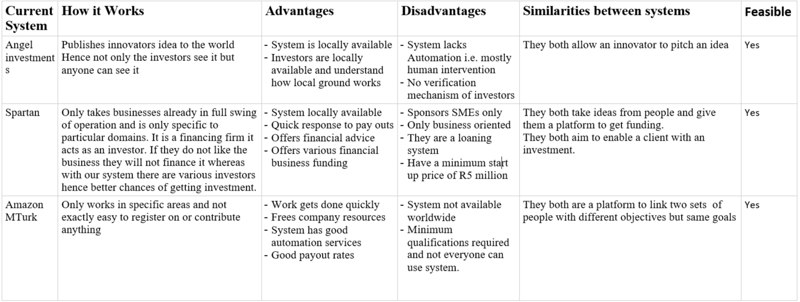
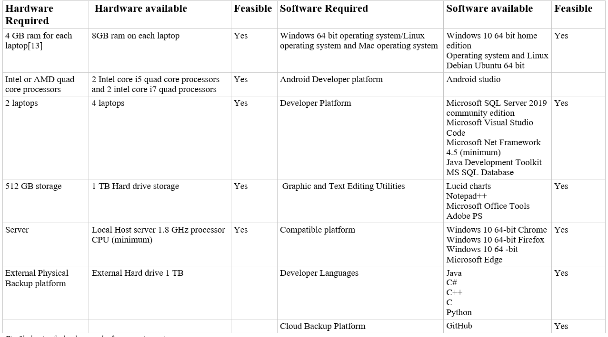
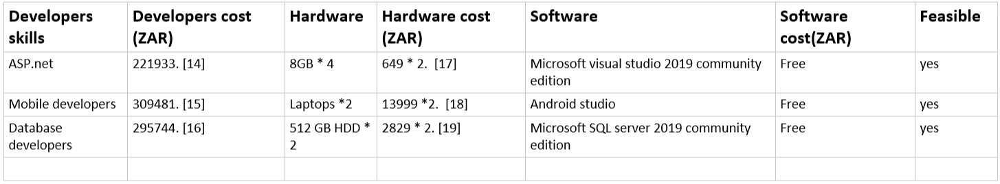

# Feasibility and Risk Study

## SYSTEM FEASIBILITY

*Fig 2a showing comparing MEEK Investment and other Systems*

## TECHNICAL FEASIBILITY

*Fig. 2b showing the hardware and software requirements.*

Based on the table in fig 2b it is clear that our system will be built without facing any technical problems as we meet all of the technical requirements.Fields such as Programming, Testing, Debugging, Developing etc. have to be addressed by the website creators. Most of the products used in the production are free to use either because they are free/open source, some because they were already available like hardware products. Another factor to consider for Technical Feasibility is the availability of technical expertise.  

Apart from hardware and software requirements the system requires the developers who will develop this system, mainly developers who have skills in ASP.net development, android development and database design/development.

## ECONOMIC FEASIBILITY

  *Fig 2c showing costs of materials required for development of the system*

The table in figure 2c shows the approximated cost of each material used in the project obtained from different source, however it is important to note that these costs will not be charged because all the materials were available before the project began like laptops(came with pre-installed windows operating system home edition) with RAMs and storage drives. As on the software side the required software are free to download and use.
Based on the data obtain from savvy it takes approximately 6 months [12]  to develop a system like this. The amount of time given to have the finish product is more than adequate so in our conclusion it is feasible to develop such system.

## OPERATIONAL FEASIBILITY
Operational feasibility refers to the study of  a proposed project to uncover the strength and weakness of the existing system [8]. With the current systems like angels investment both the innovator  and investors are required to pay a certain fee before adding their pitches on the site, with a trend like this it is easy to  discourage young and innovators without finances because they will not be able to pay such fees. However the MEEK system aims to solve such disadvantage by allowing every innovator to add pitch and apply for free by doing this we are also helping to elevate poverty in the community, since even a brighter mind that lacks finances can reach available investors. 

Operational feasibility answers to the questions of labor managements and how much man power will be available to perform the task. The MEEK team is already tasked for this project and has enough man power. Also evaluating from a legal aspect this system will conform to all legal terms and conditions. The system will abide by those terms and not beach any web laws like the fair usage laws, necessary licenses for content and privacy protection. Compliance to regulatory laws is very fundamental.

The other disadvantage is seen at Amazon MTurk, MTurk requires that every member who sign's up must have a formal qualification in order to register with the system. MEEK system does not mark that as mandatory, everyone is welcome to join.

