# VERIFICATION TEST CASES
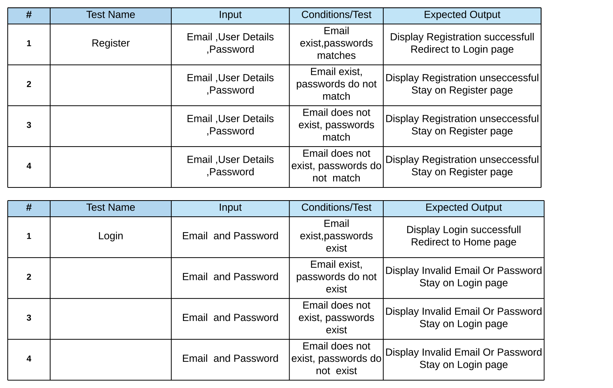
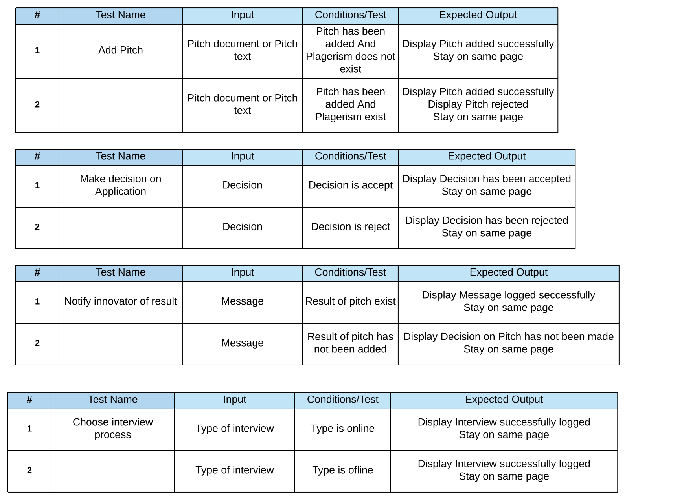
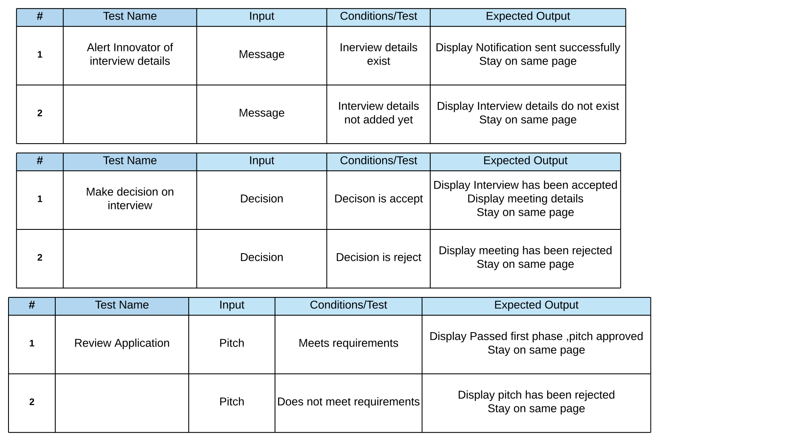
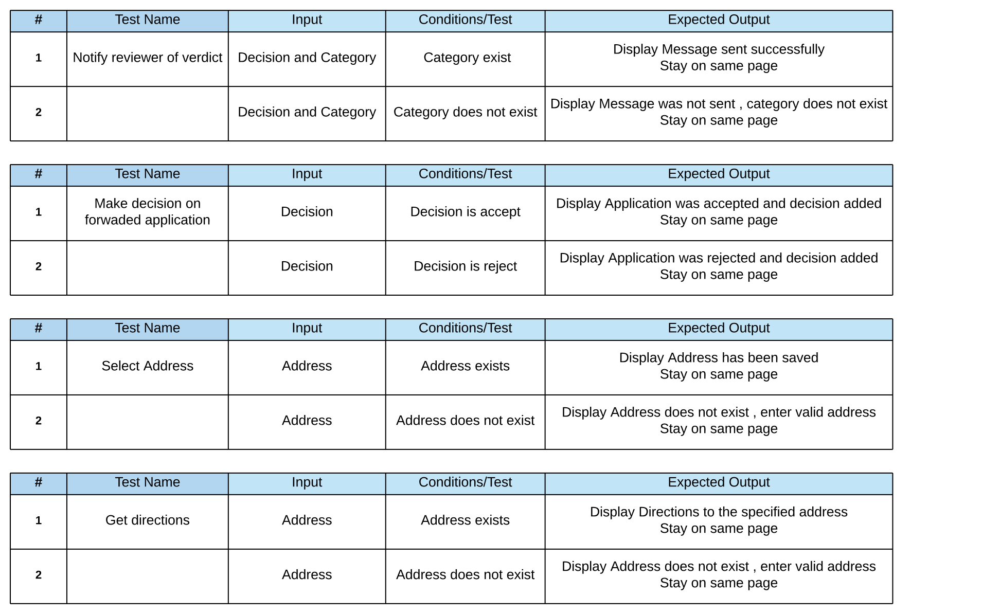
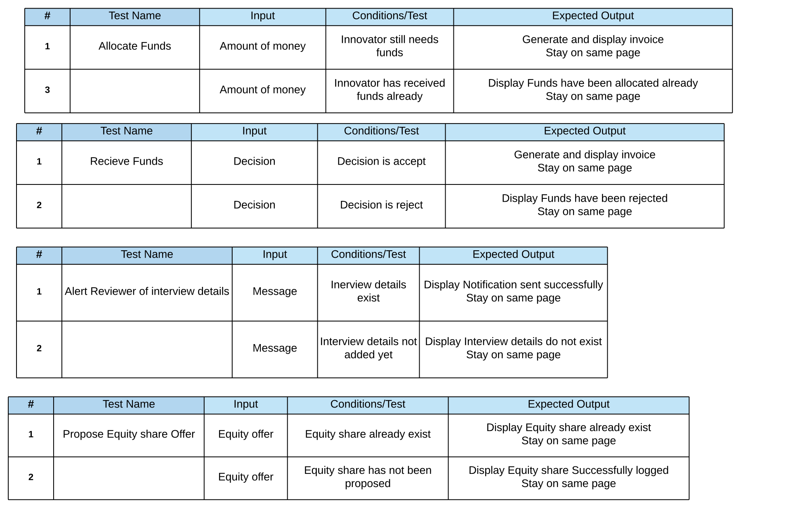
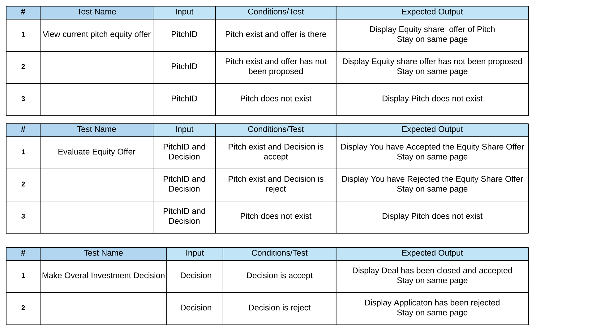

# VALIDATION TEST PLAN 
The purpose of the plan is to thoroughly check for quality and see if the website performs all the functionalities it is intended to perform and at the same time meeting the needs of the users and/or stakeholders. The test plan mainly targets various areas like security, modules, components of the website and also the final integrated website before it goes live.
Validation testing occurs after the site is developed and after completion of verification testing. The plan involves procedures like the ones mentioned below.
-	Unit testing
-	System testing 
-	Acceptance testing
-	Integration testing 

## Importance of Validation testing 
There are certain times where some points and functions might pass the verification test and actually fail when implemented in the actual website/product. This is where validation testing comes into play and is important because it aids in catching bugs and errors which where missed during verification testing. This type of testing can be done both manually and automatically.
## Validation testing procedures 

Unit testing – this will involve the developers testing the functionalities of the site in unit sizes or individual components once the coding is completed. Hence testing can be done from base functionality in small units before higher level integrated functionality. These checks are essential to test requirements.  

Integration testing – this will involve testing the individual components of the code combined together as a whole. It will help evaluate if the code compiles according to the required criteria. 
  

System testing – this will involve testing the entire complete system when the integration has been completed. It will evaluate and show bugs once the web application is live. Various categories of testing can be put under this procedure e.g. browser compatibility test, operating system compatibility.
  

User acceptance testing – this will involve presenting the application to a user and test for real world scenarios from users who are going to use the application. It will be crucial in letting developers know if the application provides and suffices to user requirements.
  

Meek investment site will include testing procedures that will occur per test unit. The testing plan will be subdivided into categories which are functional, usability, interface, compatibility, performance and security testing. These testing categories will be carried out in stages of the validation testing procedures mentioned above. 
 
## VALIDATION TESTING PLAN FOR MEEK INVESTMENTS 
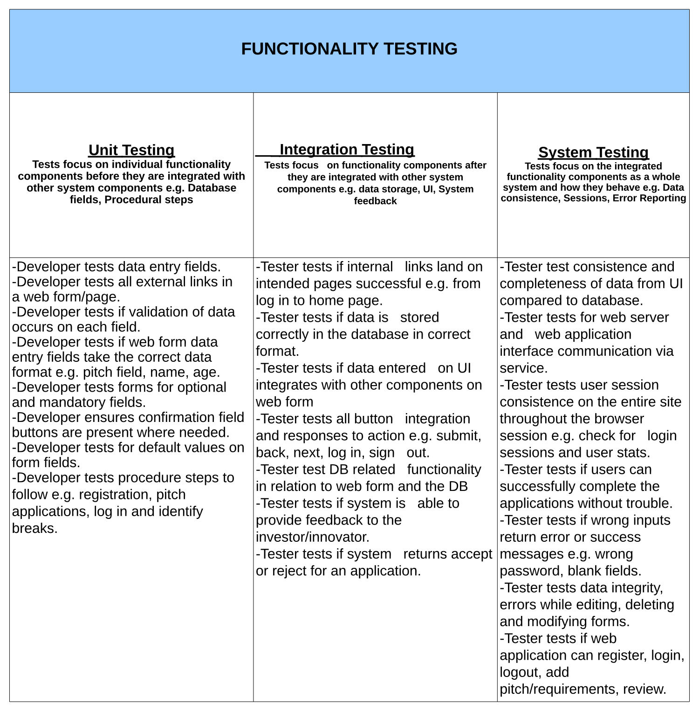
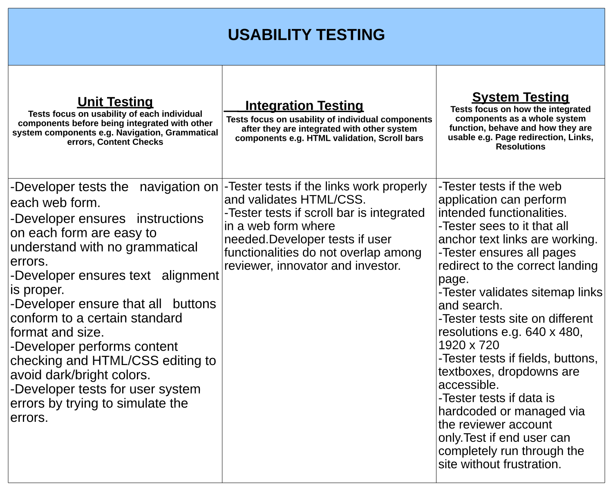
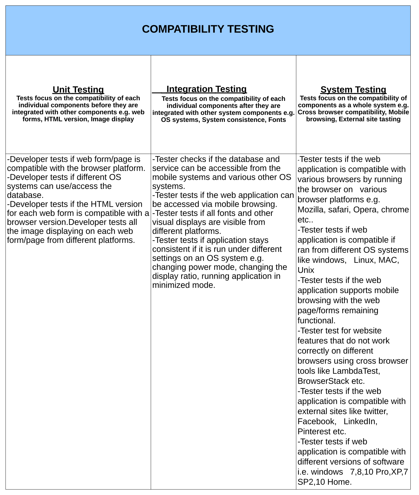
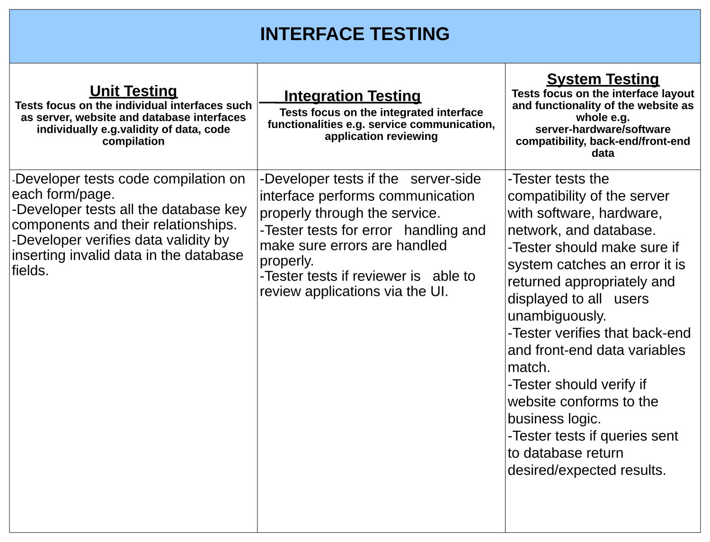
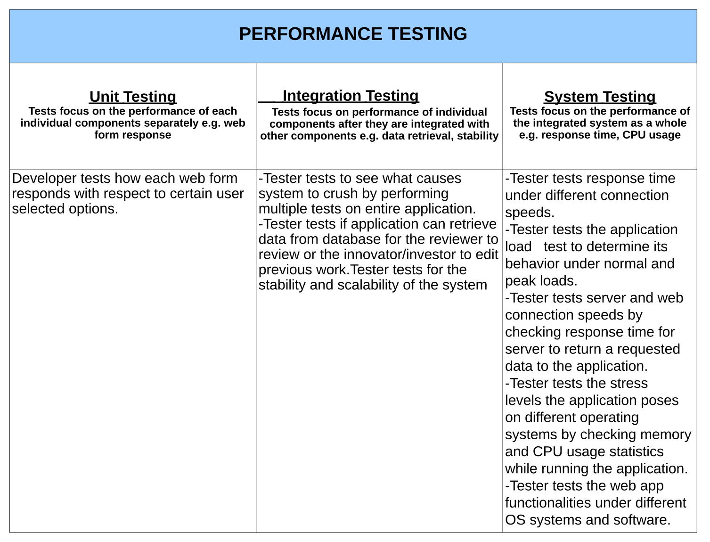
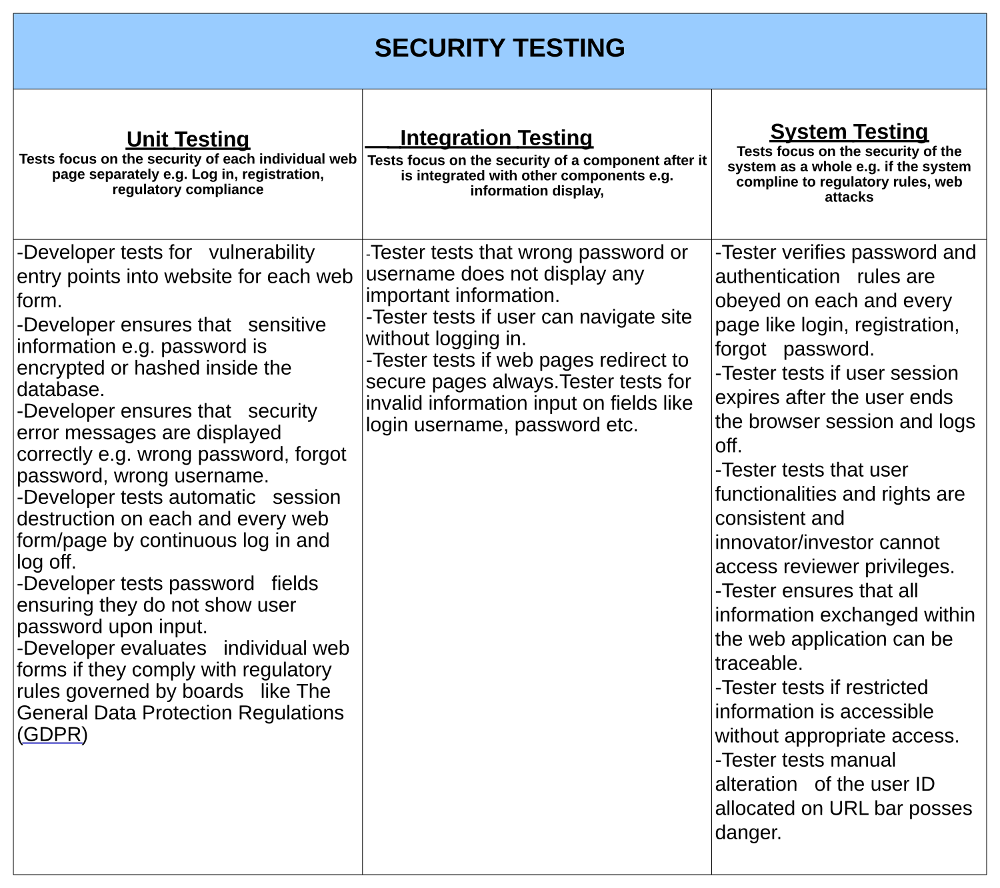
## USER ACCEPTANCE TESTING 
This is the final stage of the software testing process where we will present our system to actual users/stakeholders to use the software in a real-life scenario while at the same time identify bugs, errors and mistakes that might be embedded in the application. This stage will be performed once some of the following things have been met 

-	The business logic should be available and its requirements 
-	The web application should be fully developed 
-	Unit, Integration and System testing should be completed
-	All errors should be fixed and tested
-	A testing environment for users should be available.

When all these have been met, test cases will be drafted from the unit, integration and system testing plans above. Crucial test cases will be the ones considered. The system will then be presented to few users/stakeholders to perform the test cases under the specified conditions. The user acceptance test will allow all the testers selected to report bugs, defects, errors, broken links and give a true reflection about their user experience. It will be important for the MEEK company to know how end users feel about the web application and what kind of experience it will give them. The main point will be knowing if the application is actually solving the problem it was intended to. SSN

