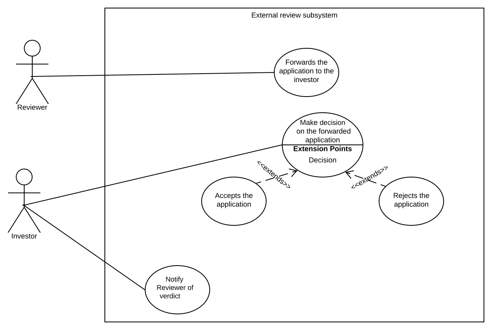
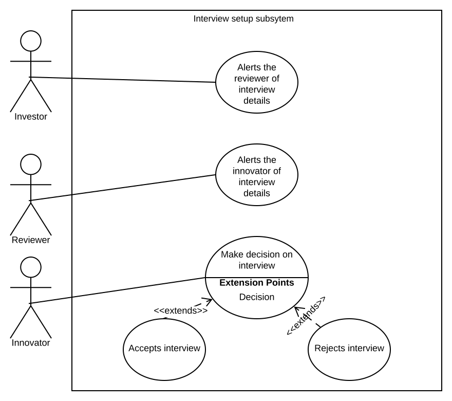
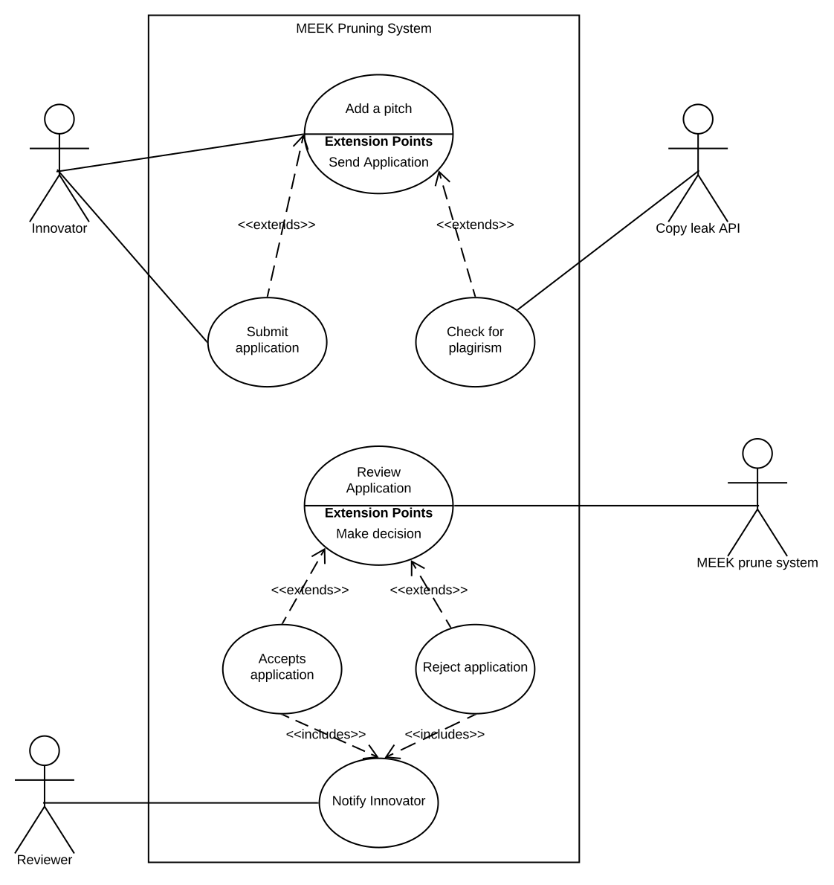
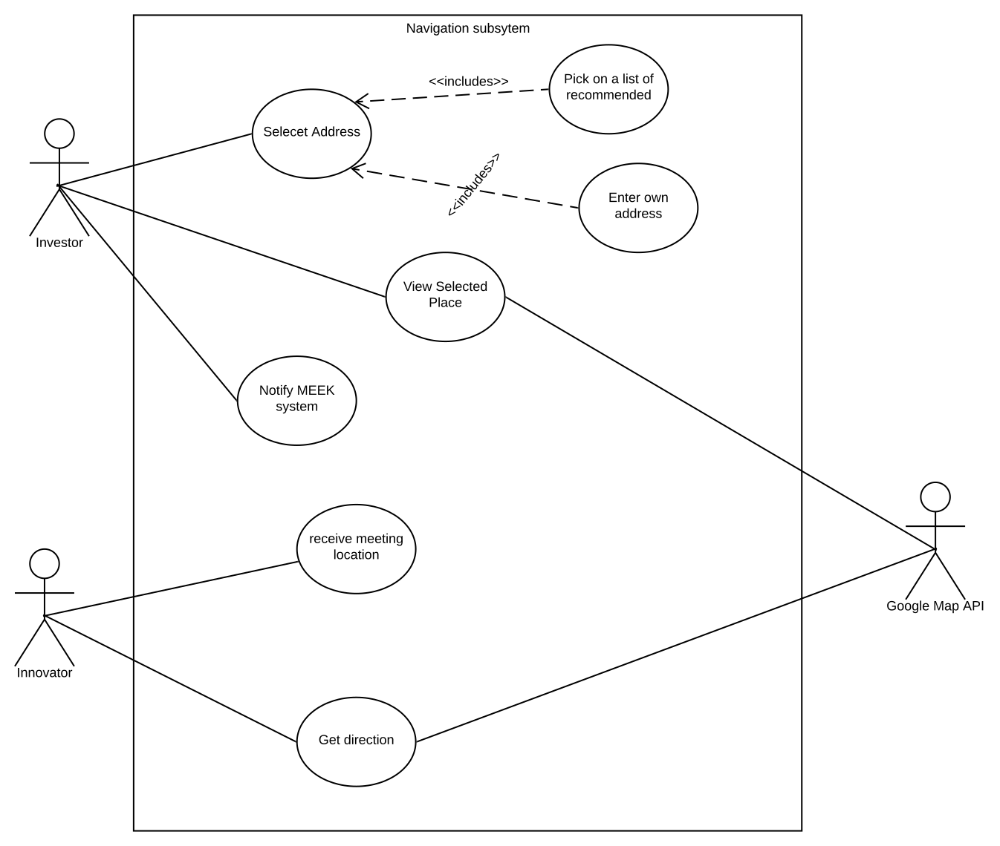
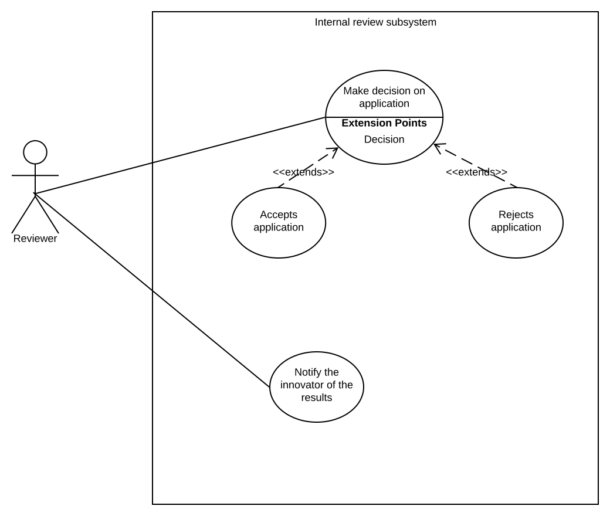

# USE CASES AND DESCRIPTIONS

## <u> REGISTRATION SUBSYTEM </u>

#### Use Case: <u> Register </u>
 
Input: User first and last name, Id number, Email address, and password
 
Output: Redirect to log in
 
1. Add a new user
 
2. The user fills in the required fields
 
3. The system validates the entered details
 
4. The system stores the user details
 
<u> Extensions </u>
 
1a.Choose type of user
 
 1. Innovator will choose to register as innovator
 
 2. Investor will choose to register as investor
 
 3. Reviewer will choose to register as reviewer
 
3a.ID number already exists in the database
 
 1. The system notifies the user of already existing iD
 
 2. The user can either change the ID or Log in
 
3b.Password does not meet minmum complex requirements
 
 1. The system notifies the user 
 
 2. The user can either fix password or cancel
 
3c.Password do not match
 
  1. The system notifies the user that password field and confirm password filed do not match
    
  2. The user can fix the password or cancel
 

#### Use Case: <u> Log in </u>
 
Input: Email address and password
 
Output: Redirect to Home page
 
1. The user enters the email and password
 
2. The system marks the user as logged in and create a session
 

<u> Extensions </u>
 
1a.Invalid email or password
 
 1. The system notifies the user that email and/or password do not match
 
 2. The user can fix the log in details or cancel
 

## <u> EXTERNAL REVIEW SUBSYSTEM </u>

#### Use Case: <u> Forwards the application to the investor </u>
 
Input: 
 
Output: The reviewed application
 
1. The reviewer forwards the application to the investor
 
2. The system confirms the activity that occured

 

#### Use case: <u> Make decision on the forwarded application </u>
 
Input: Approved application by reviewer
 
Output: Decision on the application 
 
1. The investor reviews the application by themselves
 
2. The investor either accepts or reject the application based on personal preference 
 

#### Use Case: <u> Notify reviewer of verdict </u>
 
Input: Decision
 
Output: Message to the reviewer
 
1. The Investor sends a message to the reviewer to alert of the decision taken
 
2. The system confirms the activity that occured

## <u> INTERVIEW SETUP SUBSYSTEM </u>

 

#### Use case: <u> Alerts the reviewer of the interview details </u>
 
Input: Date and time
 
Output: alerts the reviewer of Interview details
 
1. The investor send interview details to the reviewer
 
2. The system confirms the details have been sent
 

#### Use case: <u> Alerts the innovator of interview details </u>
 
Input: interview details from investor 
 
Output: alert the innovator of interview details
 
1. The reviewer send the interview details to the innovator
 
2. The system confirms the details have been sent
 

#### Use case: <u> Make decision on interview </u>
 
Input: Interview details from reviewer
 
Output: Decision taken
 
1. The innovator can either accepts or rejects the interview
 
2. The system confirms on the decision taken and send feedback to the reviewer
 

## <u> PRUNING SYSTEM </u>

#### Use Case: <u> Add a pitch </u>
 
Input: Pitch tittle, management location, industry type, stage of project, Investor role, amount raising, minimum amount from investor, short summary, the bussiness, the market, obejects and files to be uploaded (Bussiness plan, Financials, Executive summary and any other additional documents)
 
Output: Confirmation of submitted application
 
1. The user fills in the required details
 
2. The user checks for plagirism
 
3. The user submits the application
 
Extensions
 
1a.Missing mandotaory fields
 
 1. The system notifies the user of missing fields
 
 2. The user can fill in the missed fields or cancel
 
2a.Plagirism above maximum allowed percentage of plagirism
 
 1. The system notifies the user
 
 2. The user can either fix the issue or abort the application
 

#### Use Case: <u> Review Application </u>
 
Input: Application from the user
 
Output: Decision taken
 
1. The system compares the user application with the investor requirements
 
2. The System accepts the application if the requirements are met or reject if they are not met
 

#### Use case: <u> Notify Innovator </u>
 
Input: Decision from the system
 
Output: Message to the Innovator
 
1. The reviewer notifies the innovator how the first stage went
 
2. The system confirms the activity that occured

## <u> NAVIGATION SUBSYSTEM </u>

  

#### Use case: <u> Select Address </u>
 
Input: Interview location address
 
Output: 
 
1. The investor save the address location
 
2. The system confirms the saved address
 

#### Use case: <u> Notify MEEK system </u>
Input: The saved location address
 
Output: 
 
1. The Investor notifies the MEEK system 
 

#### Use case: <u> Receive meeting location </u>
 
input: 
 
output: address location saved by the Investor
 
1. The innovator retrives the saved address
 

#### Use case: <u> Get direction </u>
 
Input: address location 
 
Output: the route to take to location
 
1. The innovator enters current address
 
2. The system finds route and displays     
 

## <u> INTERNAL REVIEW SUBSYSTEM </u>

#### Use case: <u> Make decision on application </u>
 
Input: Application that passed the first stage
 
Output: Decision on the application
 
1. The reviewer reviewes the application
 
2. The reviewer accepts the application based on the guidelines provided on by the investor or rejects the application
 

#### Use case: <u> Notify the innovator of the results </u>
 
Input: Decision on the application
 
Output: Message to innovator 
 
1. Notifies the innovator of the decision taken
 
2. The system confirms the activity that occured

Use case: Select Address
 
Input: Interview location address
 
Output: 
 
1. The investor save the address location
 
2. The system confirms the saved address
 
Use case: Notify MEEK system
 
Input: The saved location address
 
Output: 
 
1. The Investor notifies the MEEK system 
 
Use case: receive meeting location
 
input: 
 
output: address location saved by the Investor
 
1. the innovator retrives the saved address
 
Use case: Get direction
 
Input: address location 
 
Output: the route to take to location
 
1. The innovator enters current address
 
2. The system finds route and displays

Use Case: Add a pitch
 
Input: Pitch tittle, management location, industry type, stage of project, Investor role, amount raising, minimum amount from investor, short summary, the bussiness, the market, obejects and files to be uploaded (Bussiness plan, Financials, Executive summary and any other additional documents)
 
Output: Confirmation of submitted application
 
1. The user fills in the required details
 
2. The user checks for plagirism
 
3. The user submits the application
 
Extensions
 
1a. Missing mandotaory fields
 
1. The system notifies the user of missing fields
 
2. The user can fill in the missed fields or cancel
 
2a. Plagirism above maximum allowed percentage of plagirism
 
1. The system notifies the user
 
2. The user can either fix the issue or abort the application
 

Use Case: Review Application
 
Input: Application from the user
 
Output: Decision taken
 
1. The system compares the user application with the investor requirements
 
2. The System accepts the application if the requirements are met or reject if they are not met
 

Use case: Notify Innovator
 
Input: Decision from the system
 
Output: Message to the Innovator
 
1. The reviewer notifies the innovator how the first stage went
 
2. The system confirms the activity that occured